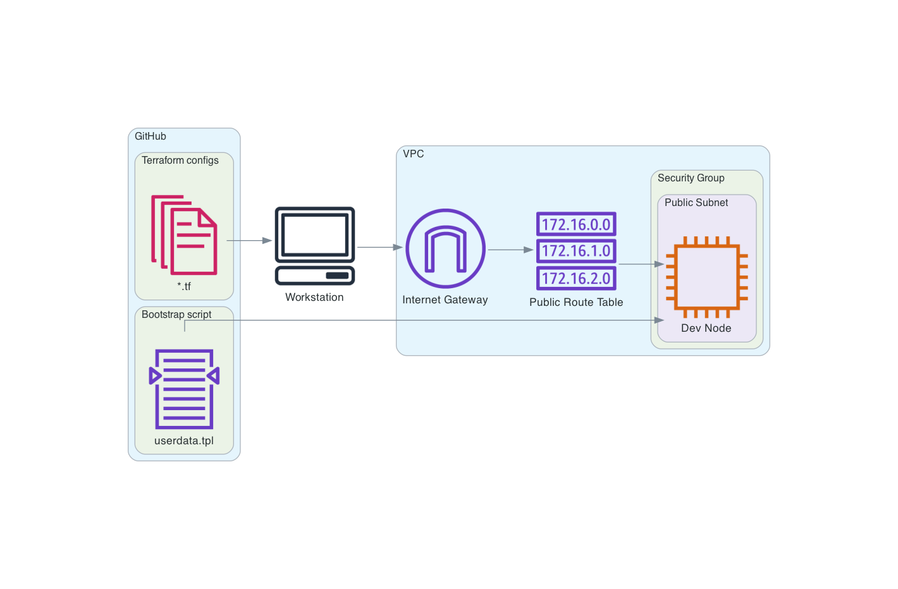

# Terraform usage
Deploy AWS resources with Terraform

## Prerequisites
1. Created AWS account
2. Installed VS Code
3. Installed Terraform

## Local setup
1. Create a user (IAM --> Create a user with programmatic access --> Administrative access)
2. Install VSCode Extention "AWS Toolkit"
3. Configure AWS Credentials profile in VSCode
4. Install VSCode Extention "Terraform"
5. Create working directory

## Architecture

Built in https://github.com/mingrammer/diagrams